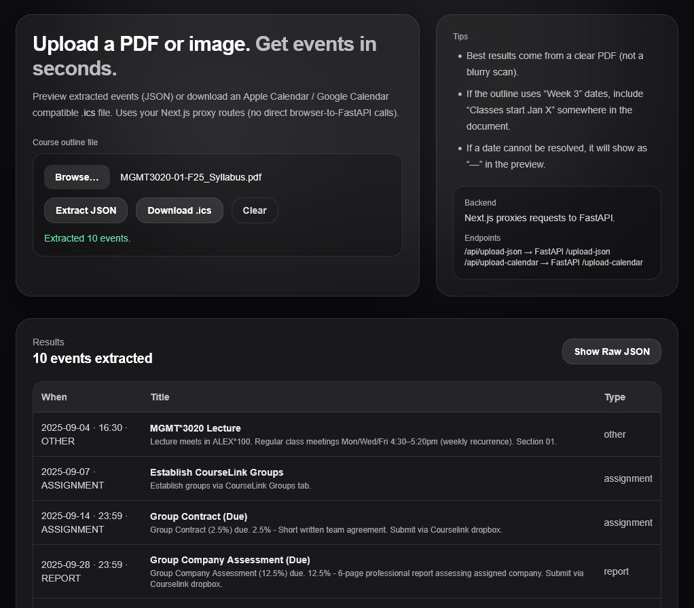

# Course Outline → Calendar Automation Tool
A full-stack application that converts university course outlines into clean academic schedules and exports them as ICS files for direct import into Google Calendar, Apple Calendar, Outlook, and other calendar apps.



## Why This Exists
Students often need to manually skim through lengthy course outlines to find lectures, deadlines, exams, and other important dates, then add each item to their calendar one by one. Doing this for multiple courses every semester is time-consuming and error-prone.

This tool is designed to save students time and mental effort by automating that process. Instead of manually extracting dates, students can upload a course outline PDF and receive a clean schedule that can be exported as an ICS file and imported directly into their calendar application of choice.

## What It Does
- Extracts structured academic events from structured or unstructured course outlines
- Normalizes inconsistent naming and formatting across outlines
- Deduplicates repeated events while preserving important details
- Merges table-based and prose-based descriptions safely
- Exports calendar-ready data suitable for ICS or Google Calendar import

## Engineering Challenges
Course outlines frequently describe the same events multiple times using inconsistent formats (e.g., tables vs prose, “Midterm 1” vs “Midterm #1”). Naive extraction approaches often produce duplicate or conflicting calendar entries.

This project focuses on **conservative parsing and merge logic** to ensure events are deduplicated safely without removing valid deliverables or losing deadlines, weights, or descriptions.

## Tech Stack
**Backend:** Python, FastAPI  
**Frontend:** Next.js, Tailwind CSS  
**APIs:** OpenAI API (used for structured extraction with deterministic post-processing)

## Example Output
```json
{
  "date": "2026-10-17",
  "title": "Midterm 1 (In-Person)",
  "event_type": "exam",
  "time": null,
  "description": "In-class midterm worth 12.5% of final grade."
}
